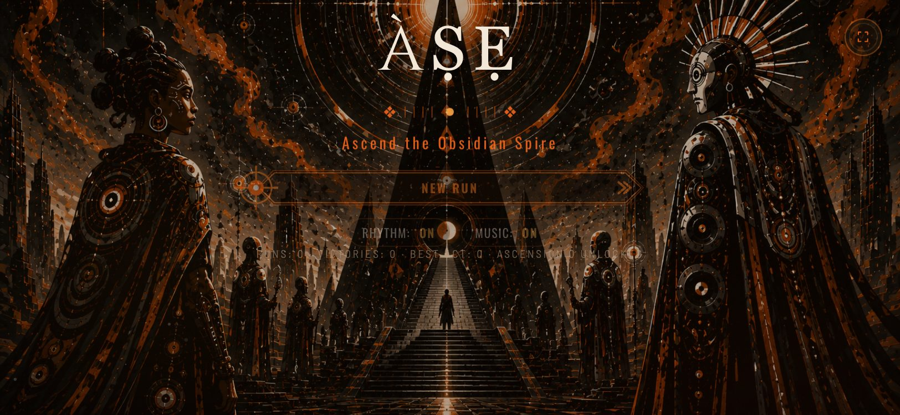
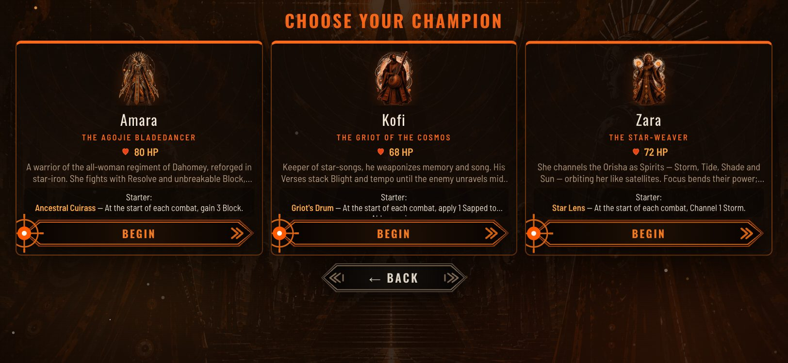
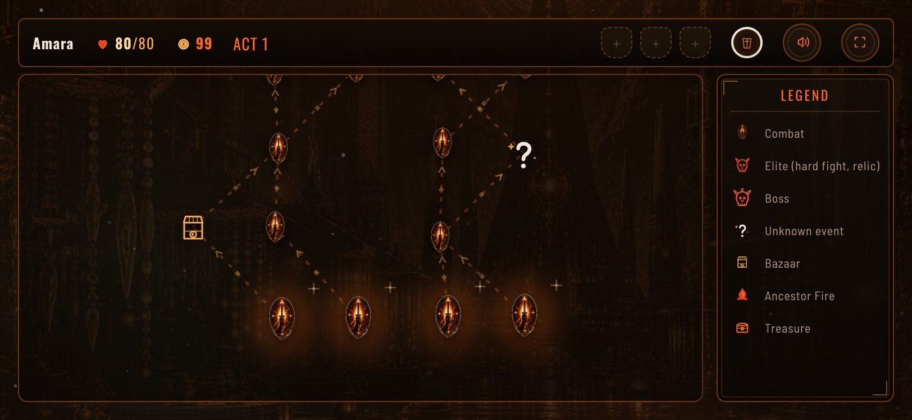
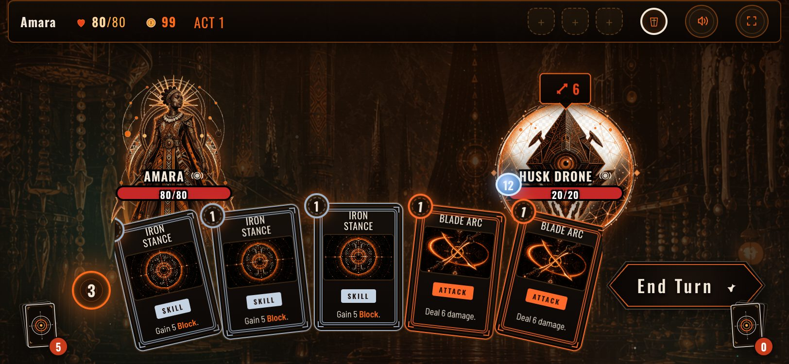
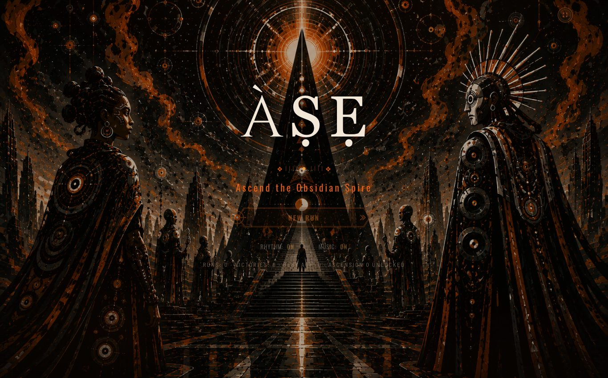
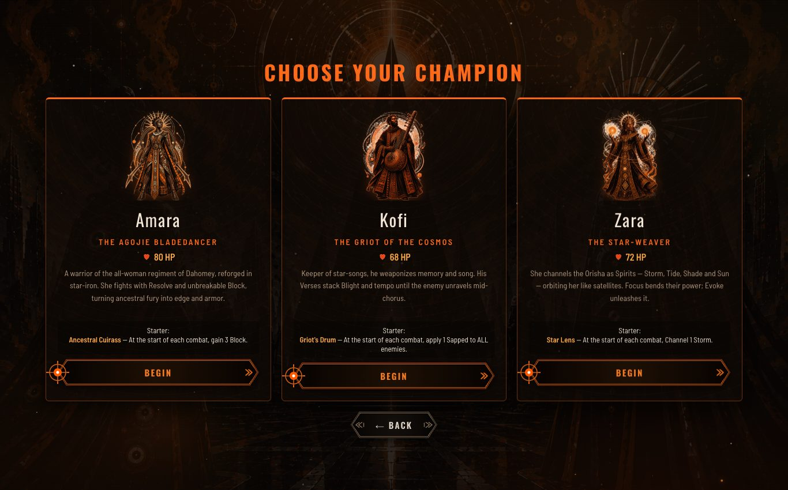
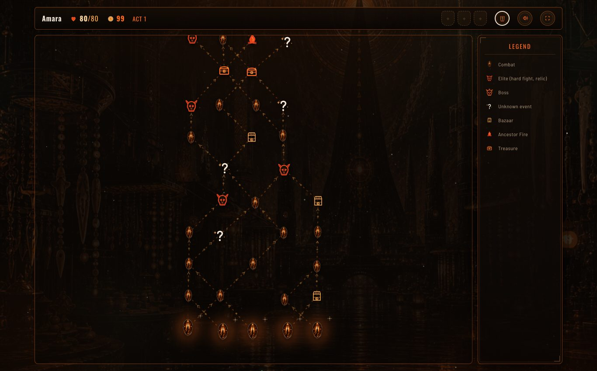
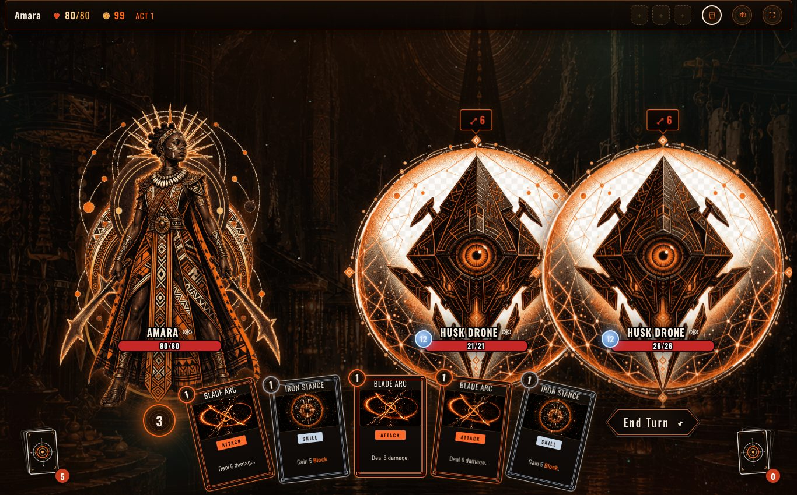

# ÀṢẸ — QA screenshot & responsiveness audit

Generated: 2026-07-02T19:19:55.067Z

Run with `node tools/qa-screenshots.js`. Screenshots and this report
are written to `docs/qa/`.

## Mobile landscape (812×375)

### Title — ✓ clean

### Character select — ✓ clean

### Act map — ✓ clean

### Combat — ✓ clean

## Desktop (1366×850)

### Title — ✓ clean

### Character select — ✓ clean

### Act map — ✓ clean

### Combat — ✓ clean

