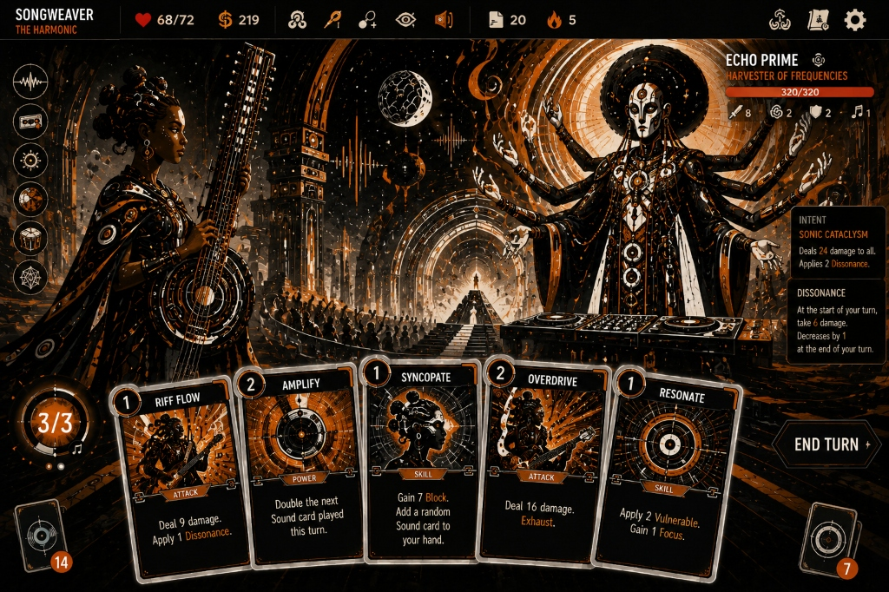

# Design Reference

Baseline reference images for ÀṢẸ: Ascend the Obsidian Spire.
These serve as the visual target for all future asset creation and UI design work.

## Combat UI Baseline

**Songweaver (The Harmonic) vs Echo Prime — Harvester of Frequencies**

Key visual elements captured in this reference:
- **Color palette**: Deep blacks, warm ambers/oranges, bronze/gold metallics
- **Card design**: Ornate circular icons, bronze borders, afrofuturist motifs
- **UI chrome**: Top-bar HUD (HP, gold, deck/discard/exhaust counts, energy, block)
- **Enemy panel**: Intent display, health bar, status effects
- **Character rendering**: Detailed afrofuturist character art with cultural instruments
- **Environment**: Concert-hall / temple aesthetic with sound-wave visual motifs
- **Typography**: Angular, bold headers; clean body text on cards
- **Card layout**: 5-card hand with fan arrangement, clear cost/type/effect hierarchy
